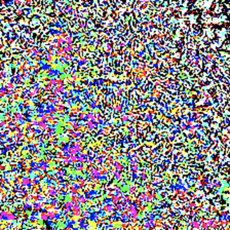
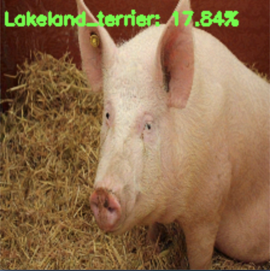

From pyimagesearch tutorial:\
(untargeted adversarial) [Adversarial images and attacks with Keras and TensorFlow](https://www.pyimagesearch.com/2020/10/19/adversarial-images-and-attacks-with-keras-and-tensorflow/)\
(targeted adversarial) [Targeted adversarial attacks with Keras and TensorFlow](https://www.pyimagesearch.com/2020/10/26/targeted-adversarial-attacks-with-keras-and-tensorflow/)

Run `python generate_basic_adversary.py --i pig.jpg`
```
[INFO] hog => 341
[INFO] 1. hog: 99.96%
[INFO] 2. wild_boar: 0.03%
[INFO] 3. hippopotamus: 0.00%
```
simple classification:\


Run `python generate_basic_adversary.py --i pig.jpg --c 341`
```
[INFO] generating perturbation...
step: 0, loss: -0.00038187362952157855...
step: 5, loss: -0.0029074561316519976...
step: 10, loss: -0.18842393159866333...
step: 15, loss: -2.9205737113952637...
step: 20, loss: -5.802796363830566...
step: 25, loss: -8.008832931518555...
step: 30, loss: -10.011468887329102...
step: 35, loss: -12.56059741973877...
step: 40, loss: -17.290119171142578...
step: 45, loss: -26.065034866333008...
[INFO] creating adversarial example...
[INFO] running inference on the adversarial example...
[INFO] label: cardigan confidence: 99.66%
```
learned delta noise:\


generated adversarial image with classification:\


Run `python generate_targeted_adversary.py --input pig.jpg --output adversarial.png --class-idx 341 --target-class-idx 189`
```
[INFO] generating perturbation...
step: 0, loss: 23.18745231628418...
step: 20, loss: 13.294694900512695...
step: 40, loss: 9.14617919921875...
step: 60, loss: 6.921018600463867...
step: 80, loss: 5.393210411071777...
step: 100, loss: 4.17207145690918...
step: 120, loss: 3.1938741207122803...
step: 140, loss: 2.331019401550293...
step: 160, loss: 1.5208311080932617...
step: 180, loss: 0.7869677543640137...
step: 200, loss: 0.13956642150878906...
step: 220, loss: -0.4244403839111328...
step: 240, loss: -0.9517326354980469...
step: 260, loss: -1.4534435272216797...
step: 280, loss: -1.9144563674926758...
step: 300, loss: -2.3453574180603027...
step: 320, loss: -2.7723283767700195...
step: 340, loss: -3.220327138900757...
step: 360, loss: -3.6895244121551514...
step: 380, loss: -4.180316925048828...
step: 400, loss: -4.683711051940918...
step: 420, loss: -5.15231990814209...
step: 440, loss: -5.64334774017334...
step: 460, loss: -6.172865867614746...
step: 480, loss: -6.749128341674805...
[INFO] creating targeted adversarial example...
[INFO] running inference on the adversarial example...
[INFO] label: Lakeland_terrier confidence: 17.84%
```
learned delta noise:\


generated targeted adversarial image with target classification Lakeland_terrier (class_idx=189):\


Notes:
- First make an initial prediction (y_true)
- Add a noise delta to image and make another prediction (y_ad)
- (untargeted) Use negative SparseCategoricalCrossentropy on y_true and y_adv to drive y_adv away from y_true by adjusting the noise delta through gradient descent
- (targeted) Use negative SparseCategoricalCrossentropy on y_true and y_adv + positive SparseCategoricalCrossentropy on y_true and y_target to drive y_adv away from y_true AND y_adv closer to y_target
- Each time noise delta is adjusted, clip the values to makes sure the noise doesn’t change the image visually
- *For the targeted adversarial generation, although in the end only 17.84% confidence that the image is the targeted label, it is still the label with the HIGHEST confidence (higher than the original true label 'hog').*
