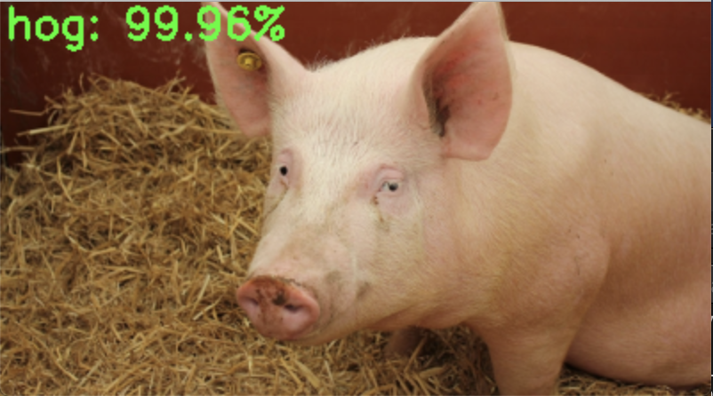
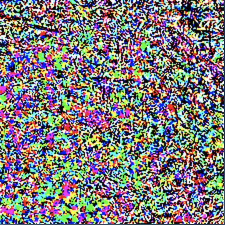
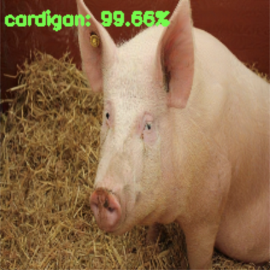

From pyimagesearch tutorial: [Adversarial images and attacks with Keras and TensorFlow](https://www.pyimagesearch.com/2020/10/19/adversarial-images-and-attacks-with-keras-and-tensorflow/)

Run `python generate_basic_adversary.py --i pig.jpg`
```
[INFO] hog => 341
[INFO] 1. hog: 99.96%
[INFO] 2. wild_boar: 0.03%
[INFO] 3. hippopotamus: 0.00%
```
simple classification:\


Run `python generate_basic_adversary.py --i pig.jpg --c 341`
```
[INFO] generating perturbation...
step: 0, loss: -0.00038187362952157855...
step: 5, loss: -0.0029074561316519976...
step: 10, loss: -0.18842393159866333...
step: 15, loss: -2.9205737113952637...
step: 20, loss: -5.802796363830566...
step: 25, loss: -8.008832931518555...
step: 30, loss: -10.011468887329102...
step: 35, loss: -12.56059741973877...
step: 40, loss: -17.290119171142578...
step: 45, loss: -26.065034866333008...
[INFO] creating adversarial example...
[INFO] running inference on the adversarial example...
[INFO] label: cardigan confidence: 99.66%
```
learned delta noise:\


generated adversarial image with classification:\


Notes:
- First make an initial prediction (y_true)
- Add a noise delta to image and make another prediction (y_ad)
- Use negative SparseCategoricalCrossentropy on y_true and y_adv to drive y_adv away from y_true by adjusting the noise delta through gradient descent
- Each time noise delta is adjusted, clip the values to makes sure the noise doesn’t change the image visually
